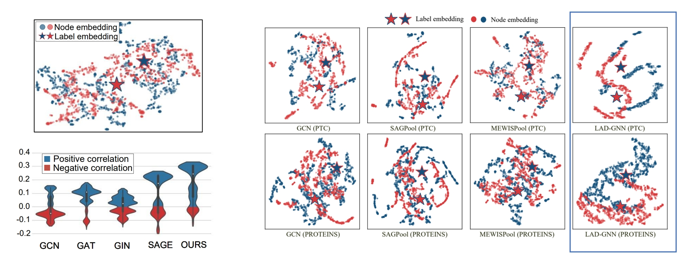
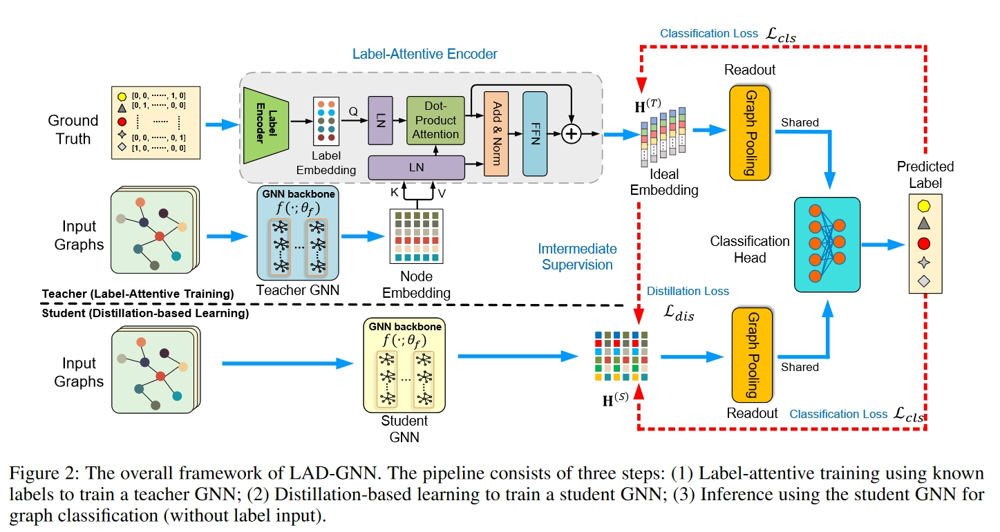
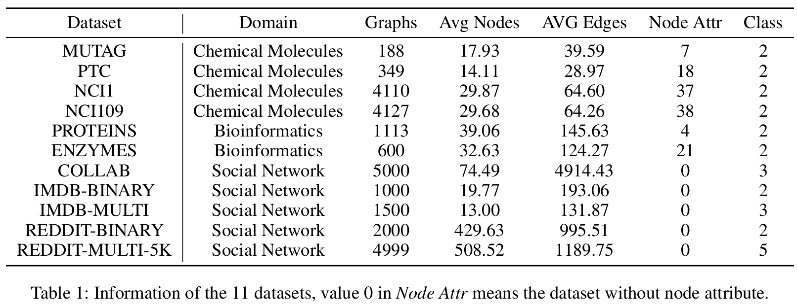
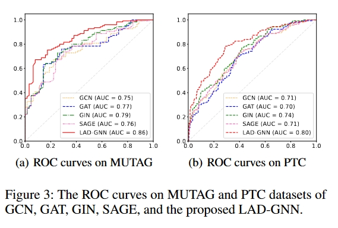

### LAD-GNN: Label Attentive Distillation for GNN-Based Graph Classification
----------------------
The implementation for "Label Attentive Distillation for GNN-Based Graph Classification" which is accepted to AAAI 2024.

#### Motivation


- The conventional GNNs perform node-level feature aggregation from neighbors or and input graph condensation without considering graph-label information, which leads to *Embedding Misalignment* problem.
- Graph label is the most important information for the graph classification tasks.
- Due to the lack of labeled inputs during training and testing, we propose a framework for labeled attentive self-distillation, which achieves labeled embedding attention while ensuring no information leakage.

Similar intuition can be found in the following CV task work:
[1] Miao Hao, et al. LabelEnc: A New Intermediate Supervision Method for Object Detection. ECCV 2020.
[2] Yaomin Huang, et al. Label-Guided Auxiliary Training Improves 3D Object Detector. ECCV 2022.
[3] Peizhen Zhang, et al. LGD: Label-guided Self-distillation for Object Detection. AAAI2022.

#### Overall Framework


#### Requirements
Here are the suggested environment:

```
- python==3.9.13
- pytorch==1.12.1
- dgl==1.0.2+cu116
- ogb==1.3.5
- sklearn
- torch-cluster==1.6.0
- torch-scatter==2.0.9
- torch-sparse==0.6.15
- torch-geometric==2.1.0
- torchvision==0.13.1
```

### Datasets


Create a new folder "/data" in main directory and it will automatically download the corresponding dataset when you run the code.


### Run the code

1. Run the teacher model with label attentive encoder:
```
python main.py --dataset MUTAG --train_mode T --device 0 --seed 1 --nhid 64 --nlayers 2 --lr 0.01 --backbone GCN
```
2. Run the student model with self-distillation:
```
python main.py --dataset MUTAG --train_mode S --device 0 --seed 1 --nhid 64 --nlayers 2 --lr 0.001 --backbone GCN
```




### Citation
If you find our work useful, please consider citing our paper:
*Hong X, Li W, Wang C, et al. Label Attentive Distillation for GNN-Based Graph Classification[C]//Proceedings of the AAAI Conference on Artificial Intelligence. 2024, 38(8): 8499-8507.*
```
@inproceedings{hong2024label,
  title={Label Attentive Distillation for GNN-Based Graph Classification},
  author={Hong, Xiaobin and Li, Wenzhong and Wang, Chaoqun and Lin, Mingkai and Lu, Sanglu},
  booktitle={Proceedings of the AAAI Conference on Artificial Intelligence},
  volume={38},
  number={8},
  pages={8499--8507},
  year={2024}
}
```